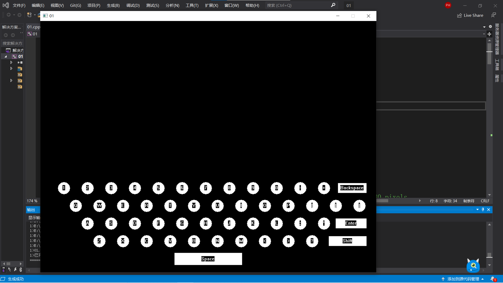
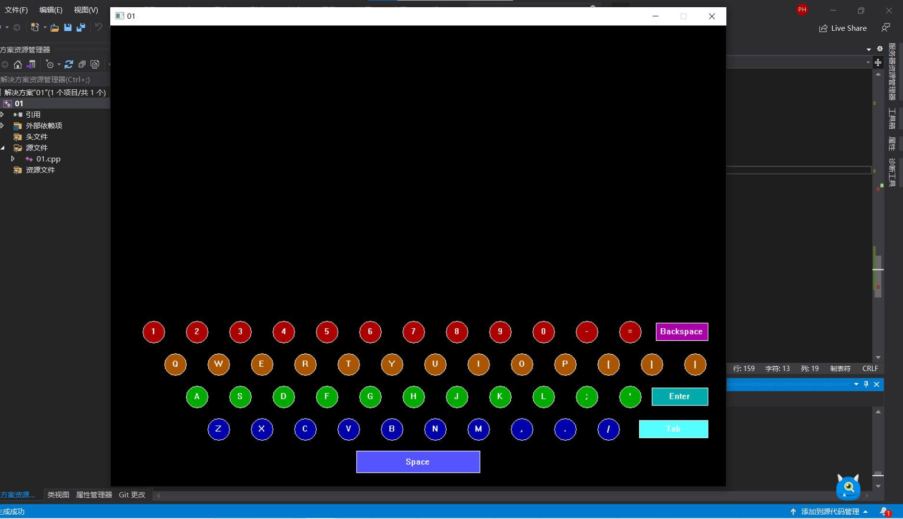
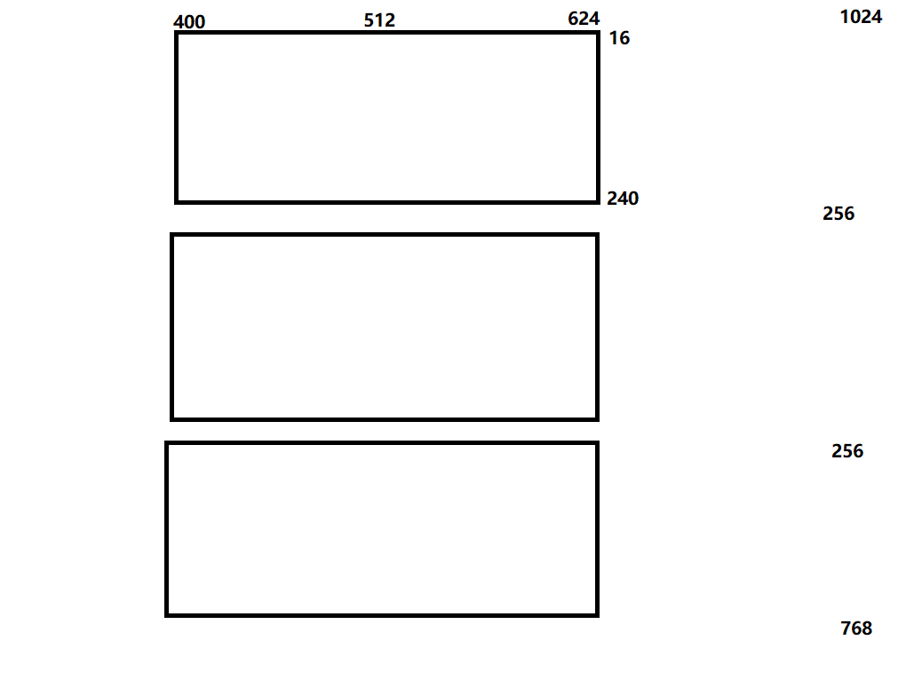
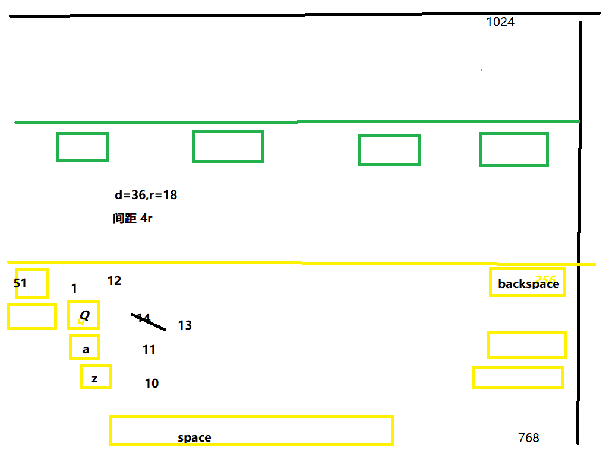

# Typing-Game
 C Project《超级程序员》游戏开发

### 环境配置 Environment Configuration
使用easyX函数库
https://easyx.cn/

### 要求 Requiremnet

游戏窗口中绘制标准键盘布局。
游戏玩家根据提示（例如在上述窗口中某个按键高亮），则按下键盘中的按键。按对则提示下一个字母，按错则继续等待按对。

游戏中的按键提示，应该是一段有意义的C程序。例如输出hello world，例如求pi程序等等。
应该有一个界面让玩家选择要练习哪个程序。

关于游戏计分，设计成：
速度模式：字符从天而降，如果不及时按对按键，此字符将落到地上，砸掉一个缺口。当缺口足够多时，就算为失败。
可以设计某个字符带有奖励，按对此字符，则会自动补上部分缺口。
可以设计计分规则。
自行对游戏模式进行扩展，设计更有意思的模式。

### 界面 Interface
KEYBOARD

Menu

### 草图 Draft
Menu

Keyboard
